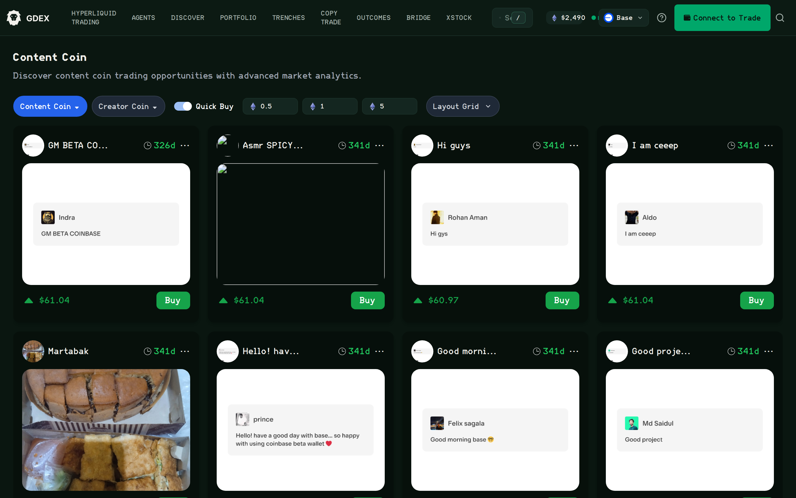

# Content and Creator Coins

GDEX Pro surfaces **content coins** and **creator coins** on Base, so you can browse social
posts that have been coined and buy them without leaving the terminal.

<figure><figcaption>
Content Coin — coined posts on Base with quick-buy amounts in ETH
</figcaption></figure>

### Content coins and creator coins

The page opens on **Content Coin** and has a second tab for **Creator Coin**. Content coins are
tied to an individual post. Creator coins are tied to the creator's own token rather than to any
single piece of content. Switch tabs to move between the two markets.

### The board

Each card shows the coined post itself — the author, the text, and any image — alongside its age
and current price, with a **Buy** button on the card. Because the post is rendered in place, you
are looking at the thing you are buying rather than a ticker that stands in for it.

### Quick Buy

Turn **Quick Buy** on and the preset amounts become one-tap buys at 0.5, 1, or 5 ETH. Quick Buy
is off by default; leave it off if you would rather confirm each purchase at its own size.

### Layout

The **Layout Grid** control changes the density of the board. The grid view shown above suits
browsing; switch layouts when you want more rows on screen at once.

### Network

Content and creator coins are a **Base** market. GDEX Pro switches the active network for you
when you open the page, and the network selector in the header will read Base while you are on
it. Your quick-buy amounts are denominated in ETH accordingly.
