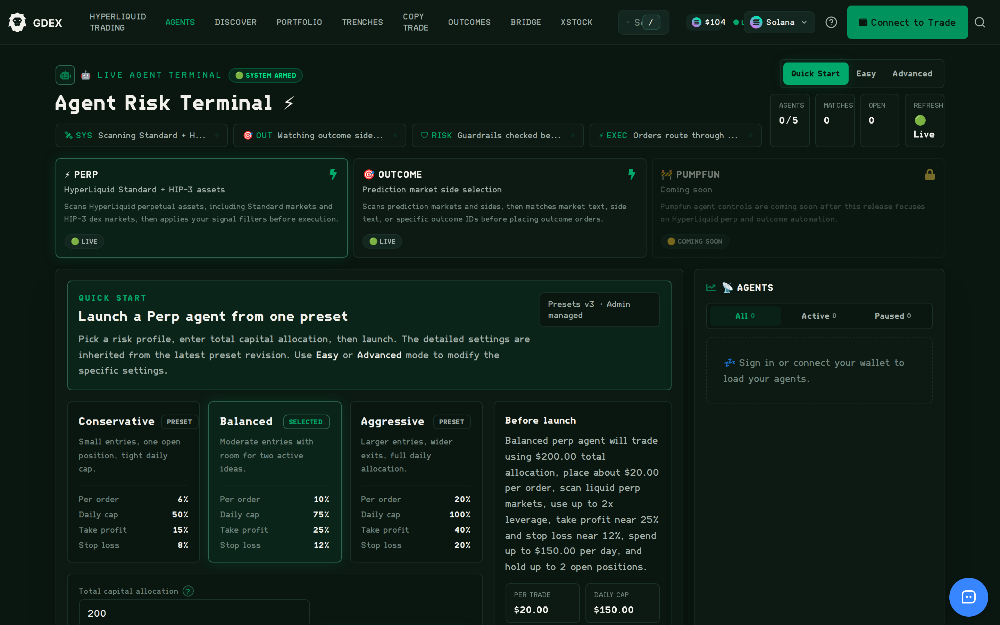

# Trading Agents

The **Agent Risk Terminal** lets you run automated trading agents on GDEX Pro. You pick a risk
profile and a capital allocation, and the agent scans markets, applies your filters, and places
orders inside guardrails you set up front. It is reached from **AGENTS** in the top navigation.

<figure><figcaption>
The Agent Risk Terminal — agent types, risk presets, and the pre-launch summary
</figcaption></figure>

### Agent types

| Agent | Status | What it does |
| --- | --- | --- |
| **Perp** | Live | Scans HyperLiquid perpetual assets, including Standard markets and HIP-3 dex markets, then applies your signal filters before execution. |
| **Outcome** | Live | Scans prediction markets and sides, then matches market text, side text, or specific outcome IDs before placing outcome orders. |
| **Pumpfun** | Coming soon | Pumpfun agent controls arrive after this release, which focuses on HyperLiquid perp and outcome automation. |

### Risk presets

Every agent launches from a preset. The preset sets four limits, and each is enforced before an
order is placed rather than after.

| Preset | Per order | Daily cap | Take profit | Stop loss |
| --- | --- | --- | --- | --- |
| Conservative | 6% | 50% | 15% | 8% |
| Balanced | 10% | 75% | 25% | 12% |
| Aggressive | 20% | 100% | 40% | 20% |

Percentages are of your total capital allocation. Conservative allows one open position with a
tight daily cap, Balanced allows room for two active ideas, and Aggressive uses the full daily
allocation with wider exits.

### Three ways to configure

* **Quick Start** — pick a preset, enter a total capital allocation, and launch. Detailed
  settings are inherited from the latest preset revision.
* **Easy** — adjust the headline settings without leaving the preset structure.
* **Advanced** — set the individual signal filters and execution parameters yourself.

Presets are versioned and administered centrally, so the terminal shows which revision your
agent inherited.

### Before you launch

The terminal shows a plain-language summary of what the agent will actually do before you
commit. For a Balanced perp agent with a $200 allocation, that reads as: trade using $200 total
allocation, place about $20 per order, scan liquid perp markets, use up to 2x leverage, take
profit near 25% and stop loss near 12%, spend up to $150 per day, and hold up to 2 open
positions.

Read this summary every time. It is derived from the settings you just chose, so it is the
fastest way to catch a mis-typed allocation before it becomes an order.

### Limits and monitoring

* You can run up to **5 agents** at once.
* The header strip shows live counts for agents, matches, and open positions, plus a refresh
  indicator so you can see the system is armed and scanning.
* The **Agents** panel lists your agents as All, Active, or Paused. You need to sign in or
  connect your wallet to load them.

### Guardrails

Agents check risk before execution, not after. The status strip spells out the four stages in
order: the system scans markets, watches outcome sides, checks guardrails, and only then routes
orders. An agent cannot place an order that breaches its per-order size, daily cap, or open
position count.
