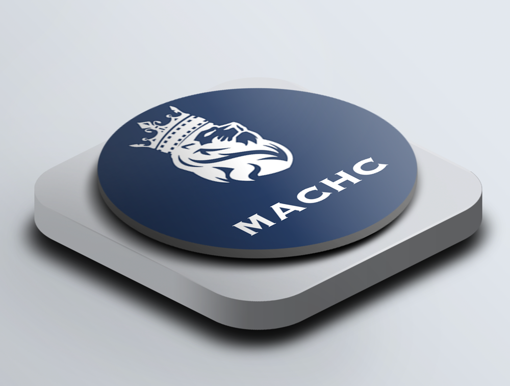

# 📊 GFund

### Diversified exposure to new assets, staking, and LP pools

**Gemach’s index funds offer accessible exposure to complex on-chain strategies.** Instantly access powerful yield-earning strategies through new assets, staking, leverage, liquidity pools, and more. A powerful combination with a track record of performance.

**Access** [<mark style="color:blue;">**MACHC**</mark>](https://www.tokensets.com/#/v2/set/0xf73642407B8d471cDbc60a095c9D9B28EfCDd710) **now and diversify your exposure**

Gemach will routinely introduce new index funds for the community that are DAO-controlled. This will give more choice and optionality. Gemach DAO retains 20% of the gains as a nominal fee to keep Gemach operational and build new features.

<figure><figcaption></figcaption></figure>

## Simple, Self-Custodial & Secure

### Simple

Gemach index fund tokens are ERC-20, making it simple to store or modify your strategy. Gemach simplifies complex strategies into a single token, we reduce the number of overall transactions users make, saving time, fees, and effort.

### Self-Custodial

You are always in control of your index fund tokens and they can be stored on any Ethereum wallet. They are available to redeem or trade on-chain 24/7, via decentralized exchanges and can be used via the broader DeFi ecosystem.

### Secure

GFund is built on the secure blockchain platform [Token Sets](https://www.tokensets.com/) ([audits](https://www.tokensets.com/#/security)). Gemach does rigorous due diligence on all our strategies and ensures that all 3rd party systems meet our standards of security, accessibility, and ease of use.

### Are you ready to capture yield? Here's how to get started!

### 1. Connect Wallet

Connect your decentralized wallet to the Token Sets portal.

### 2. Approve Assets

Approve the assets that you want to use which could be ETH, wBTC or USDC.

### 3. Deposit Funds

Make a deposit in the portal by swapping ETH or other assets for the index fund token.

### 4. See The Results

Index funds are routinely updated and rebased allowing you to monitor the performance.
