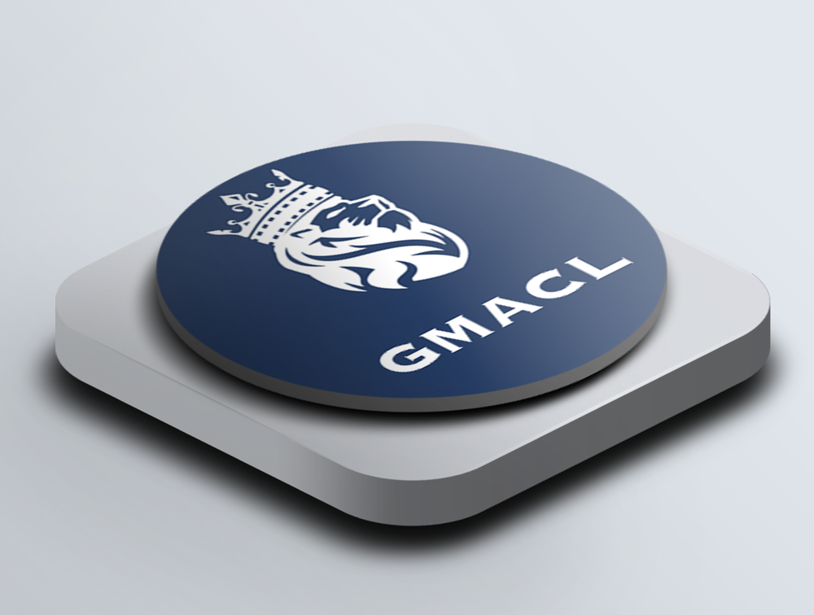

# 🔓 GVault

This vault is focused on providing liquidity to defi protocols and - in return - earning excellent rewards from those protocols for the liquidity.

100% noncustodial. No staking is required. We are genuinely building financial freedom.

**Access** [<mark style="color:blue;">**GMACL**</mark>](https://gmacl.enzyme.community/vault/0x740cbfefb9ca9c1c99d95b711e959dd960f8bdb6) **now and start earning rewards**

<figure><figcaption></figcaption></figure>

## Simple, Self-Custodial & Secure

### Simple

Gemach index fund tokens are ERC-20, making it simple to store or modify your strategy. Gemach simplifies complex strategies into a single token, we reduce the number of overall transactions users make, saving time, fees, and effort.

### Self-Custodial

You are always in control of your index fund tokens and they can be stored on any Ethereum wallet. They are available to redeem or trade on-chain 24/7, via decentralized exchanges and can be used via the broader DeFi ecosystem.

### Secure

GFund is built on the secure blockchain platform [Enzyme](https://enzyme.finance/) ([audits](https://github.com/enzymefinance/protocol/tree/v4/audits)). Gemach does rigorous due diligence on all our strategies and ensures that all 3rd party systems meet our standards of security, accessibility, and ease of use.

### Are you ready to capture yield? Here's how to get started!

### 1. Connect Wallet

Connect your decentralized wallet to the Enzyme portal.

### 2. Approve Assets

Approve the assets that you want to use which could be ETH, wBTC or USDC.

### 3. Deposit Funds

Make a deposit in the portal by swapping ETH or other assets for the index fund token.

### 4. See The Results

Index funds are routinely updated and rebased allowing you to monitor the performance.
